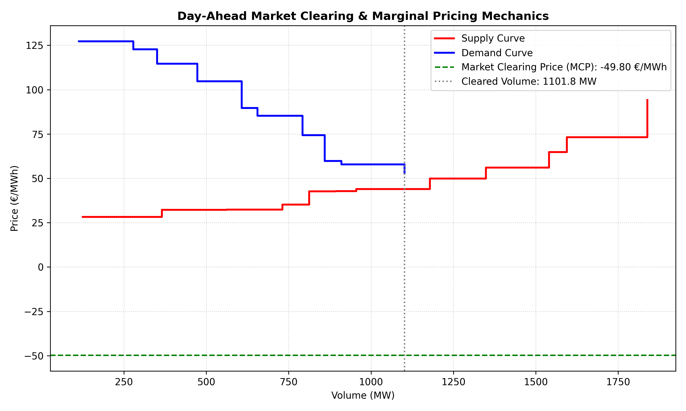

# ⚡ Alpine Hydro & Cross-Border Power Flow Model

[](https://circleci.com/gh/alpine-hydro-cross-border-power-flow-model-pyatm8mf2rywfe6sfap.streamlit.app/)
[](https://alpine-hydro-cross-border-power-flow-model-pyatm8mf2rywfe6sfap.streamlit.app/)
[](https://www.python.org/)

An interactive engineering and data analytical application modeling seasonal water and power flow dynamics across Alpine borders (Switzerland and Germany), complemented by a **Day-Ahead Market Clearing and Marginal Pricing Simulator**.

---

## 🚀 Live Demo
Explore the interactive application deployed on Streamlit Cloud: [Alpine Hydro Model Live App](https://alpine-hydro-cross-border-power-flow-model-pyatm8mf2rywfe6sfap.streamlit.app/)

---

## 📊 Key Features
- **Alpine Reservoir Dynamics:** Simulates seasonal storage depletion curves during critical winter months.
- **Cross-Border Power Flows:** Models ENTSO-E style cross-border power exchange based on price spreads between Germany (DE) and Switzerland (CH).
- **Day-Ahead Market Clearing Simulator:** Solves social welfare maximization using Linear Programming (`PuLP`) to determine Market Clearing Prices (MCP) and complex order interactions.
- **Interactive Simulation Controls:** Real-time sidebar adjustment of critical reservoir thresholds and arbitrage spread limits.
- **Automated CI/CD Pipeline:** Continuous integration testing via CircleCI (`pytest`).

---

## 🎛️ Interactive Parameters Table

| Parameter | Default Value | Range | Description |
| :--- | :---: | :---: | :--- |
| **Swiss Reservoir Critical Level** | 40.0% | 20.0% - 60.0% | Threshold below which Swiss winter scarcity pricing kicks in. |
| **Arbitrage Spread Threshold** | 15.0 €/MWh | 5.0 - 30.0 €/MWh | Minimum price spread required to trigger cross-border arbitrage opportunities. |

---

## 📈 Market Clearing & Hydro Analytics

The model evaluates market equilibrium through supply-demand curve intersections and marginal pricing mechanics:



---

## 🏗️ Repository Architecture

```text
alpine_hydro_model/
│
├── .circleci/
│   └── config.yml                   # CircleCI CI/CD pipeline configuration
│
├── outputs/                         # Generated charts and market clearing CSV reports
│   ├── market_clearing_demand.csv
│   ├── market_clearing_dynamics.png
│   └── market_clearing_supply.csv
│
├── src/                             # Modular core source code
│   ├── __init__.py
│   ├── data_loader.py               # Data generation and pipeline loading
│   ├── hydro_model.py               # Analytical balance & arbitrage calculations
│   └── visualizer.py                # Multi-panel professional plotting functions
│
├── tests/                           # Automated unit testing suite
│   ├── __init__.py
│   ├── test_data_loader.py          # Pytest verification for data structure
│   └── test_hydro_model.py          # Pytest verification for calculations
│
├── .gitignore                       # Ignored files and caches
├── .python-version                  # Pinned Python runtime version (3.11)
├── README.md                        # Project documentation
├── requirements.txt                 # Python package dependencies
├── alpine_hydro_model.ipynb         # Exploratory Jupyter Notebook & Market Simulator
└── main.py                          # Streamlit interactive dashboard entry point
